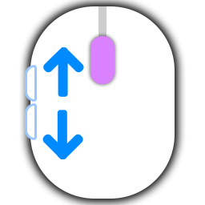

  

<h1 align="center">Xbtn2PgScroll</h1>

🖱️ 将鼠标侧键映射为 PageUp / PageDown 的 Windows 小工具

---

## 功能

- 全局拦截鼠标侧键（XBUTTON1 / XBUTTON2）
- XBUTTON1 → PageDown，XBUTTON2 → PageUp
- 拦截原始事件，侧键不会触发浏览器"后退/前进"
- 系统托盘常驻，右键菜单退出
- 无窗口、无界面、零依赖

## 使用

1. 从 [Releases](https://github.com/jark006/Xbtn2PgScroll/releases) 下载 `Xbtn2PgScroll.exe`
2. 若打开软件无法生效，则需以**管理员权限**运行（低级鼠标钩子需要提升权限），若未以管理员运行，会弹窗提示并退出
3. 托盘图标出现即生效，侧键已被映射

## 工作原理

使用 `SetWindowsHookExW` 安装系统级低级鼠标钩子（`WH_MOUSE_LL`），在事件到达任何应用之前拦截 XBUTTON 按下/释放事件，通过 `SendInput` 注入对应的键盘按键，并吞掉原始鼠标事件。

## 许可证

[MIT License](LICENSE)
